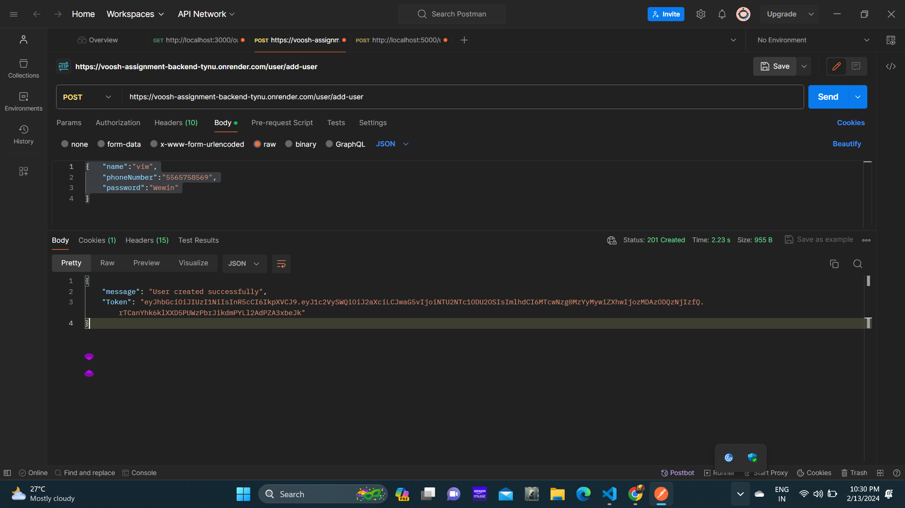
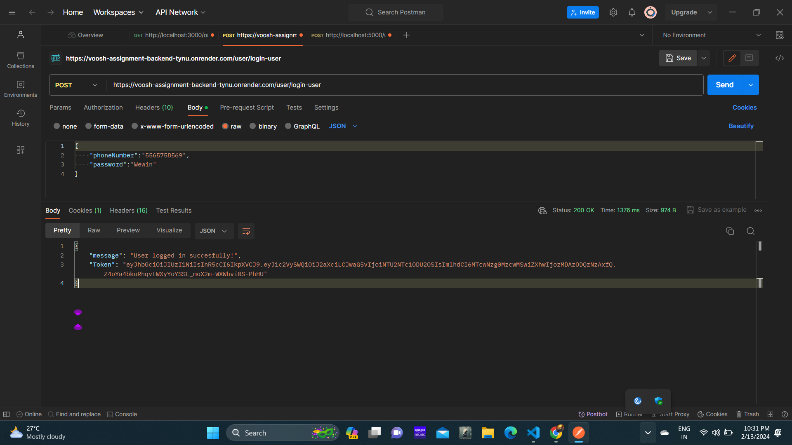
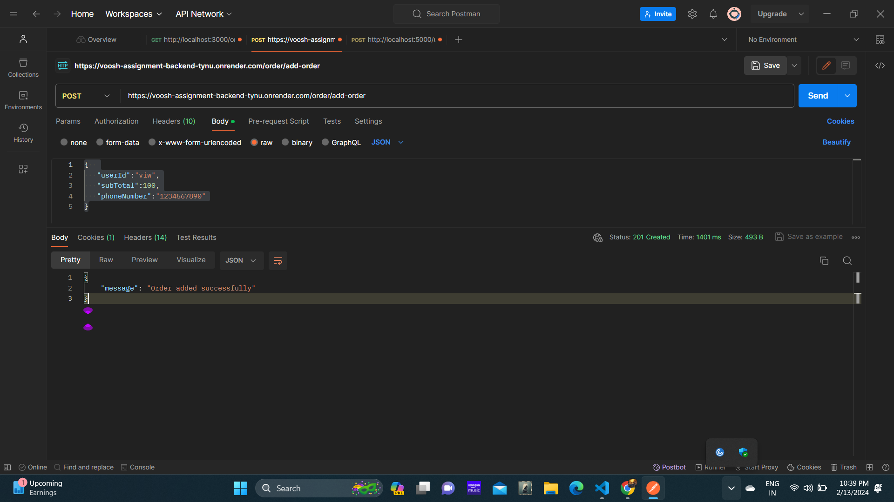
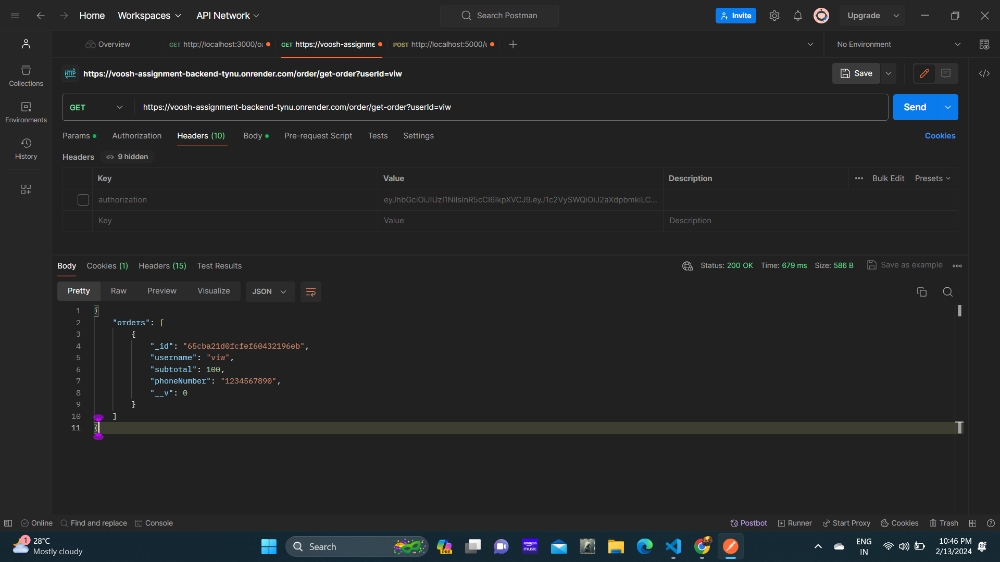
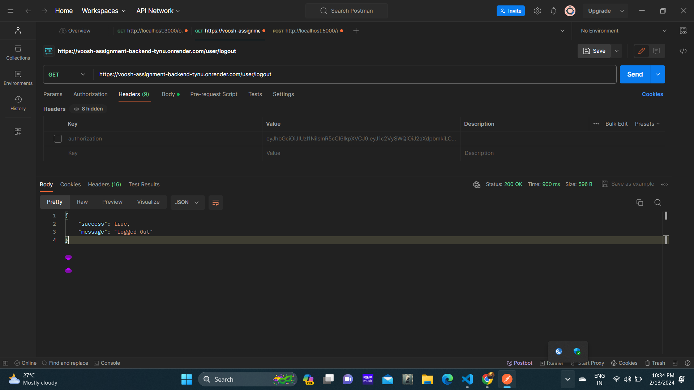

# Voosh Assignment (NodeJS Assignment)

## Tech Stacks used:
### Backend- NodeJS & ExpressJS, MongoDB
### Frontend- ReactJS

## Hosted link for the frontend:
https://voosh-assignment-viwin.vercel.app/

## Hosted link for the backend:
https://voosh-assignment-backend-tynu.onrender.com

# Routes 
## Sample Route for sign up user:
https://voosh-assignment-backend-tynu.onrender.com/user/add-user

### sample input:
{   "name":"viw",
    "phoneNumber":"5565758569",
    "password":"Wewin"
}
### sample output:

## Sample Route for login user:
https://voosh-assignment-backend-tynu.onrender.com/user/login-user

### sample input:
{  "phoneNumber":"5565758569",
    "password":"Wewin"
}

### sample output:

## sample Route to add order
https://voosh-assignment-backend-tynu.onrender.com/order/add-order

### sample input:
{  "userId":"viw",
   "subTotal":100,
   "phoneNumber":"1234567890"
}

### sample output:

## sample Route to get orders:

https://voosh-assignment-backend-tynu.onrender.com/order/get-order?userId=viw

### sample output:

## Sample Route for logout user:
https://voosh-assignment-backend-tynu.onrender.com/user/logout

### sample output:

# Getting started:

### Clone the application: 
git clone https://github.com/viwinkumarpadala/voosh_assignment.git

## open terminal Change directory to the frontend:
cd frontend
## install dependencies
npm install
## start the server
npm start

## open a new terminal and change directory to backend:
cd backend
## install dependencies
npm install
## start the server
nodemon index.js

## dot env file:
 DB_URL=

 PORT=

## Note:
### If you want to use this locally, then change the urls to your local urls first and then use it.

## With this the application is ready with all the requirements

# THANK YOU
